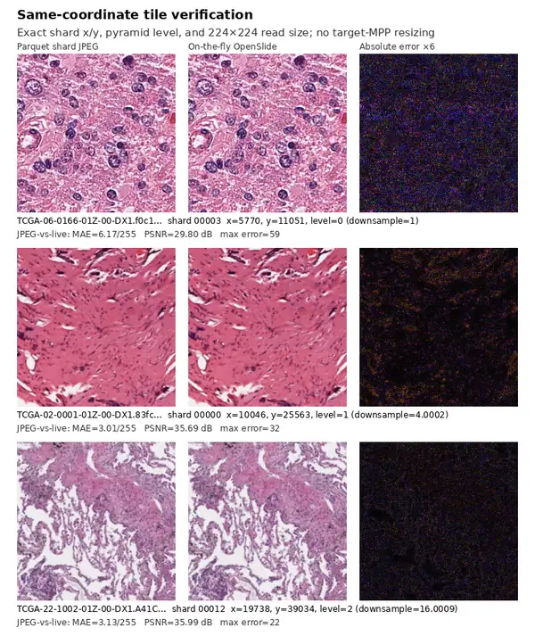

# Tile loading in NanoPath

NanoPath historically trained from four million pre-extracted JPEGs in Parquet shards. The current working-tree implementation reuses those exact four-million level-0 `(x, y)` locations but reads pixels directly from the source TCGA whole-slide images (WSIs) at a continuously sampled 0.25–2.0 MPP. The coordinate pool, patient split, tissue curation, and training recipe match the `lr-and-curation` main baseline; direct reads and continuous MPP are the experimental changes.

## Historical Parquet tiles

OpenMidnight's [`create_sample_dataset_txt.py`](https://github.com/MedARC-AI/OpenMidnight/blob/main/prepatching_scripts/create_sample_dataset_txt.py) generated the source list by visiting every WSI pyramid level and randomly trying top-left `(x, y)` locations until one passed its HSV tissue filter. It wrote one row as:

```text
/path/to/slide.svs x y level
```

The level was therefore systematic, not randomly chosen: the generator attempted a tissue tile at every available level during every pass over the slides. Coordinates were random, the completed list was shuffled, and NanoPath later selected a deterministic random four-million-row subset. Each selected region was read as 224×224 pixels at its recorded level and saved with Pillow as a quality-95 JPEG before being packed into Parquet.

The actual shard level distribution is:

| Pyramid level | Tiles | Fraction |
| ---: | ---: | ---: |
| 0 | 1,048,812 | 26.2203% |
| 1 | 1,045,837 | 26.1459% |
| 2 | 1,041,423 | 26.0356% |
| 3 | 862,701 | 21.5675% |
| 4 | 1,227 | 0.0307% |
| **Total** | **4,000,000** | **100%** |

OpenSlide always interprets `(x, y)` as a level-0 location, while the requested 224×224 output size is measured at `level`. Higher levels therefore cover progressively larger physical fields. For a slide with 4× pyramid steps, levels 0, 1, and 2 cover roughly 1×, 4×, and 16× the level-0 field width.

## Current on-the-fly loader

The working-tree loader reads the path column but not the JPEG column from the historical shards. For each presentation it:

1. Looks up the exact historical level-0 top-left `(x, y)` and the slide's native MPP.
2. Samples target MPP linearly and independently from `[0.25, 2.0]`; every floating-point value in the interval is valid.
3. Uses the WSI pyramid level whose native MPP is nearest to the target and reads from the unchanged `(x, y)` origin.
4. Resizes the physical field to 224×224 with Lanczos.
5. Applies the original saturation-based tissue curation and produces two global and eight local augmented views without an intermediate JPEG.

This samples physical fields 56–448 μm wide. It preserves tissue locations but replaces the historical discrete level mixture and JPEG pixels with continuous physical resolution and raw WSI pixels.

Of the 11,368 historical slides, 11,276 expose measured MPP through OpenSlide. The remaining 92 legacy slides have no physical-resolution value in any slide property; their 17,682 coordinate rows (0.44% of the pool) use the project's explicit 0.5 native-MPP convention so the experiment does not drop baseline coordinates.

| Property | Historical shards | Current on-the-fly loader |
| --- | --- | --- |
| Coordinate pool | Random tissue locations from `sample_dataset_30.txt`; 4M selected | Same 4M rows |
| Coordinate meaning | Level-0 top-left `(x, y)` | Same level-0 top-left `(x, y)` |
| Scale | Levels 0–4; 224 px at the selected level | Linear-uniform target MPP from 0.25–2.0 |
| OpenSlide read level | Recorded level | Native level nearest to sampled MPP |
| Storage/decoding | Quality-95 JPEG stored in Parquet | Raw WSI RGB read at presentation time |
| Tissue filtering | OpenMidnight filter plus online saturation threshold 0.5 | Same curation |

## Matched-setting visual verification

The examples below deliberately bypass fixed MPP. For each shard tile, the live column uses the exact historical `x`, `y`, pyramid level, and 224×224 output size encoded in its path. The right column amplifies absolute pixel error sixfold.



Across six examples—two each from levels 0, 1, and 2—the decoded shard JPEG versus raw live pixels had mean absolute error 3.70/255 and mean PSNR 34.48 dB. Re-encoding every live read with the historical Pillow `quality=95` setting reproduced the stored JPEG byte-for-byte in all 6/6 cases. Thus OpenSlide coordinates and levels match exactly; the visible residual is solely the lossy JPEG step. The full-resolution six-example artifact is at `/data/hm/nanopath/comparisons/shard_vs_on_the_fly_same_settings.png` on the MedARC cluster.

This test validates the on-the-fly mechanism at matched settings. It does not establish equivalence between the historical discrete multi-level recipe and the continuous target-MPP recipe.

## Throughput and training-window capacity

The initial loader was benchmarked on the broader 7,493-slide Slidebloom pool with the real ten-view augmentation pipeline. Those measurements motivate the same worker-local intervals, bounded slide-handle LRU, and nearest-pyramid-level reads in the matched-coordinate implementation; the new 4M-coordinate recipe retains the main baseline's online tissue rejection and needs its own preflight measurement.

| Batch | Workers | Cache | Condition | Tiles/s |
| ---: | ---: | ---: | --- | ---: |
| 32 | 16 | 64 | Baseline, online tissue rejection | 237.4 |
| 32 | 16 | 64 | No redundant rejection | 260.5 |
| 32 | 16 | 512 | Worker-local, warm | 324.6 |
| 32 | 32 | — | Original Parquet/JPEG shards, warm | **911.1** |
| 32 | 32 | 512 | Fixed 0.5 MPP, warm | 575.8 |
| 32 | 32 | 512 | Uniform 0.2–2.0 MPP, nearest level, warm | 472.7 |
| 128 | 32 | 512 | Production-shaped, warm | 546.3 |
| 128 | 64 | 512 | Production-shaped, warm | 698.2 |
| 128 | 96 | 512 | Production-shaped, warm | **783.0** |

At 783 source tiles/s, including generation of all two global plus eight local views:

- Loader-only capacity is **2,818,800 tile presentations/hour**.
- Loader-only capacity over the two-hour maintainer validation window is **5,637,600 presentations**.
- Supplying one million presentations takes about **1,277 seconds, or 21.3 minutes**, if nothing applies backpressure.
- One million source presentations create **10 million augmented views**: two million global and eight million local.

NanoPath's leaderboard contract still caps a full run at **1,000,000 tile presentations**, and `train.py` constructs a sampler with exactly that many indices. Therefore a valid run can actually consume at most **one million tiles**, even though the loader could deliver about 5.64 million in two hours. End-to-end training is slower than the loader-only estimate because GPU forward/backward passes, validation, and probing apply backpressure; the README's expected full-run wall time is about one hour.

The earlier 96-worker CPU benchmark peaked at 125.8 GB aggregate host RSS. The matched-coordinate recipe uses 32 workers because its measured 413.4 tiles/s is already near the model's consumption rate and the smaller allocation can share an H100 node; end-to-end data wait and GPU utilization remain the production checks.

The broader-pool 0.2–2.0-MPP preflight drew 8,192 values from 0.2005 to 1.9998 MPP with mean 1.0973; six equal-width bins contained `[1400, 1322, 1389, 1379, 1341, 1361]` samples. Its completed full run scored 0.62124 versus 0.63565 for main, but coordinate pool and curation changed simultaneously. The matched-coordinate 0.25–2.0 run removes those confounders.

The matched-coordinate preflight verified all 4,000,000 rows: 3,803,209 train coordinates across 10,804 slides and 196,791 held-out coordinates across 564 slides, with zero slide overlap. In 4,096 measured presentations, MPP ranged from 0.2501 to 1.9995 with mean 1.1180; seven equal-width bins contained `[601, 572, 629, 564, 573, 577, 580]`. Nearest-level selection used levels `[0, 1, 2]` for `[694, 3352, 50]` reads and delivered 413.4 fully augmented tiles/s with 32 workers while retaining the main recipe's tissue threshold.

A controlled 32-worker test measured 4,096 tiles with the same ten-view augmentation pipeline. The pristine original Parquet/JPEG shard loader delivered **911.1 tiles/s**, dynamic native-level reads delivered **455.1 tiles/s**, and forcing every live read through level 0 delivered **192.7 tiles/s**. Dynamic loading therefore retains 50.0% of shard throughput (50.0% slower), but selecting level 1 or 2 makes it **2.36× faster** than naive live level-0 loading. At high target MPP, level 0 must decode a much wider source region before shrinking it to 224 px; the closer pyramid level keeps the decoded region near model resolution.

## Interpretation

On-the-fly reading is pixel-faithful and fast enough to supply the capped NanoPath run. The matched-coordinate experiment isolates the remaining image-scale/storage change:

- Main: historical `(x, y, level)` rows decoded from quality-95 JPEG shards.
- Experiment: the same `(x, y)` rows decoded live at continuous 0.25–2.0 MPP.

These recipes change the data seen by the model and must be compared with the fixed downstream probes; they are not interchangeable storage backends.

The controlled full run completed 999,936 presentations without preemption under SLURM job `383833`. It scored **0.627231 mean probe score**, versus **0.635654** for the main `lr-and-curation` baseline: a **-0.008422** regression, exceeding NanoPath's 0.006 materiality threshold. It improved **+0.005992** over the earlier confounded broader-pool run (0.621239), narrowly below that threshold. Restoring the coordinates and curation recovered most, but not all, of the earlier loss; direct reads plus continuous 0.25–2.0-MPP sampling are therefore materially worse than main under this controlled recipe.
